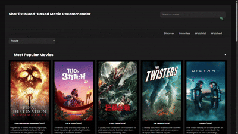
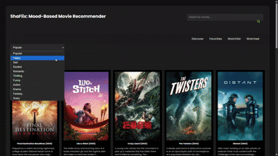
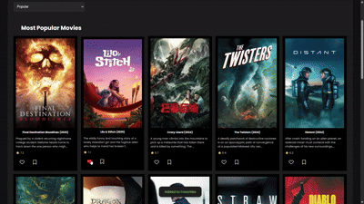
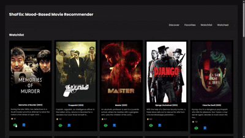
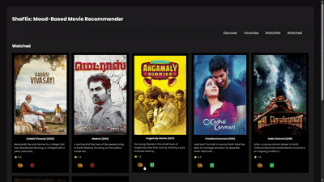

# 🎬 ShaFlix - Mood-Based Movie Recommender

ShaFlix is a lightweight web application designed to help you discover movies based on your mood, manage watchlists, favorites, and maintain your personal movie diary.

---

## 🚀 Features

✅ Mood-based movie recommendations  
✅ Search movies by title  
✅ Add movies to your Favorites list  
✅ Track watched movies  
✅ Maintain a personal movie diary (Add/Delete entries)  
✅ Responsive design for desktop and mobile  

---
## 🛠️ Tech Stack

- **HTML5, CSS3** - Frontend structure & styling  
- **Vanilla JavaScript** - Core functionality  
- **TheMovieDB API** - Movie data and posters  
- **LocalStorage** - Store Favorites, Watchlist, and Diary data locally  

---

## 🖥️ Preview

### 🏠 Home Page

---

### 🔍 Movie Search

---

### 🎭 Mood Picker Recommendations

---

### ❤️ Add to Favorites

---

### ✅ Watchlist Management

---

### 📖 Movie Diary

---

## 🎯 Conclusion

ShaFlix is a simple yet effective platform to discover movies based on your mood and maintain your personal movie space. Whether you're in the mood for action, romance, or just exploring — ShaFlix makes your movie journey seamless and fun.